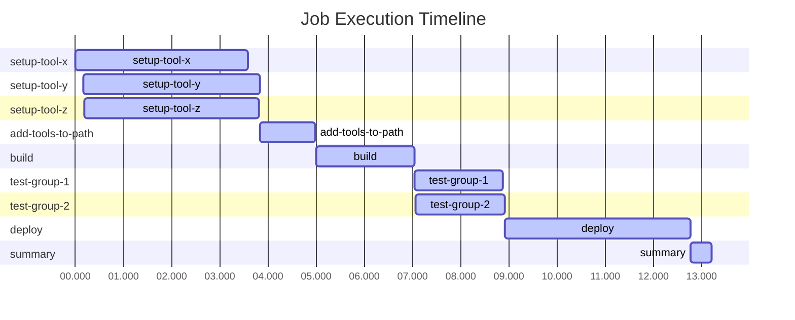

[](https://github.com/chad-golden/actions-parallel-steps/actions/workflows/test-pwsh.yml)
[](https://github.com/chad-golden/actions-parallel-steps/releases)

# Parallel Job Step Execution (pwsh.exe)
The purpose of this action is to provide parallel script execution at the job step level within GitHub Actions to decrease the amount of time it takes to run workflows. This action is intended to support `pwsh` scripts only.

## Usage
To run parallel tasks within a single step, you can provide a simplistic YAML syntax to orchestrate your parallel task execution. See [the test workflow](https://github.com/chad-golden/actions-parallel-steps/blob/main/.github/workflows/test-pwsh.yml) for more examples.

```yaml
my-job:
  runs-on: ubuntu-latest
  steps:
  - name: Sample Build Process
    uses: chad-golden/actions-parallel-steps/pwsh@main
    with:
      steps: |
        install-tool-x:
          run: |
            ...

        install-tool-y:
          run: |
            ...

        add-tools-to-path:
          needs: [install-tool-x, install-tool-y]
          run: |
            ...
```

## Parallel Tasks Summary
This action will output a summary that outlines time savings of using a parallelized workflow, a timeline of script execution, and a dependency graph of the script execution.

| Job | Duration | Status | Dependencies |
|-----|----------|--------|--------------|
| setup-tool-x | 4s | ✅ | none |
| setup-tool-y | 4s | ✅ | none |
| setup-tool-z | 4s | ✅ | none |
| add-tools-to-path | 1s | ✅ | setup-tool-x, setup-tool-y, setup-tool-z |
| build | 2s | ✅ | add-tools-to-path |
| test-group-1 | 2s | ✅ | build |
| test-group-2 | 2s | ✅ | build |
| deploy | 4s | ✅ | test-group-1, test-group-2 |
| summary | 0s | ✅ | deploy |

### Time Analysis
- Total job processing time: 22.04s
- Time saved through parallelization: 8.83s
- Efficiency gain: 40%

### Task Timeline


### Task Dependency Graph
```mermaid
graph TD
    setup-tool-x[setup-tool-x]
    style setup-tool-x fill:#3fb950
    setup-tool-y[setup-tool-y]
    style setup-tool-y fill:#3fb950
    setup-tool-z[setup-tool-z]
    style setup-tool-z fill:#3fb950
    add-tools-to-path[add-tools-to-path]
    style add-tools-to-path fill:#3fb950
    setup-tool-x --> add-tools-to-path
    setup-tool-y --> add-tools-to-path
    setup-tool-z --> add-tools-to-path
    build[build]
    style build fill:#3fb950
    add-tools-to-path --> build
    test-group-1[test-group-1]
    style test-group-1 fill:#3fb950
    build --> test-group-1
    test-group-2[test-group-2]
    style test-group-2 fill:#3fb950
    build --> test-group-2
    deploy[deploy]
    style deploy fill:#3fb950
    test-group-1 --> deploy
    test-group-2 --> deploy
    summary[summary]
    style summary fill:#3fb950
    deploy --> summary